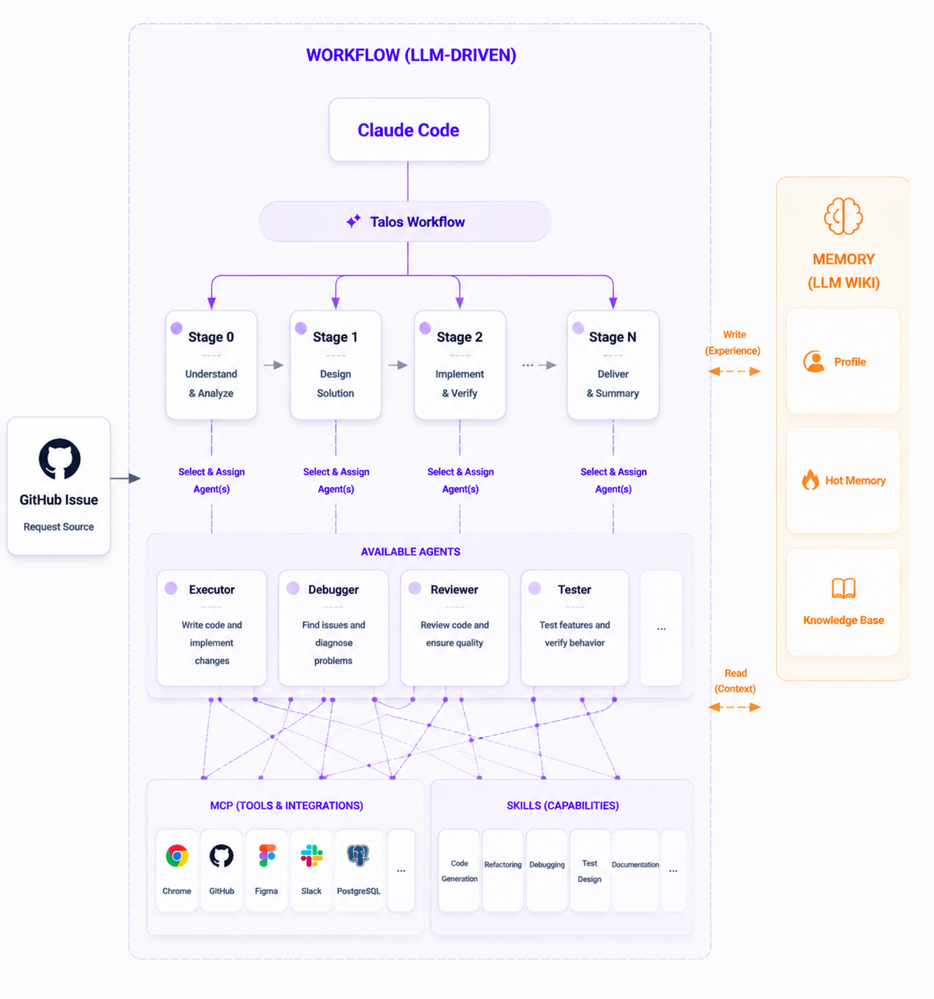

# Talos

Talos 是一个基于自然语言实现的 harness workflow 编排器，你只需要去描述 workflow 的步骤，借助 coding agent 提供的 subagent，你可以在一个会话完成一个长链路任务的执行。 

## Quick Start

**1. 安装 CLI**

```bash
npm install -g talos-cli
```

**2. 安装 Workflow**

```bash
talos install issue2code
```

**3. 运行 Workflow**

```bash
claude --dangerously-skip-permissions
# claude code：
# /workflow issue2code https://github.com/ob-labs/talos/issues/xx
```

在 Claude Code 中输入 `/workflow` 开始使用。

### 内置 Workflows

| 名称 | 用途 |
|------|------|
| `issue2code` | 从需求到代码的完整流程：同步 issue → PRD → 拆分 → 实现 → 审查 → E2E 验证 |
| `debug` | 缺陷诊断与修复：理解缺陷 → 调试循环 → 审查 |

## 架构



### Talos vs 传统 Workflow 平台

| 维度 | 传统平台（Dify） | Talos |
|------|------------------|-------|
| 编排方式 | 确定性节点，硬编码每步函数调用 | 自然语言 workflow.md，agent 自主选择执行策略 |
| 执行路径 | 严格预定义，每次走相同路径 | 约束内自主判断，不同场景可能走出不同路径 |
| 节点单元 | 函数/API 调用 | Agent（独立 subagent 上下文） |
| 上下文管理 | 全局共享，token 膨胀 | 每个 Agent 上下文隔离 |
| 知识沉淀 | 无 | 记忆自进化，越用越聪明 |

Talos 是 coding agent 的 harness，通过自然语言编排文件约束 agent 如何运行，而非硬编码每个步骤。

## 命令

### `talos list`

列出可用的 builtin workflows。

### `talos install [name]`

安装 workflow 到当前目录。

```bash
talos install              # 交互选择
talos install issue2code   # 安装指定 workflow
```

### `talos graph`

启动 web dashboard 查看会话执行图。默认端口 3456，可通过 `--port` 指定。

## 扩展

你可以在自己的仓库中维护自定义 workflow，满足日常开发需求。

### 创建自定义 Workflow

1. 进入你的项目仓库
2. 安装 skill：

```bash
npx skills add qingquan/talos
```

3. 启动 Claude Code 并运行 workflow-creator：

```bash
claude --dangerously-skip-permissions
# claude code：
# /workflow-creator create a workflow for my daily xx
```

生成的 workflow 目录结构：

```
your-repo/
└── workflows/
    └── <workflow-name>/
        ├── workflow.md       # 必需：编排定义
        ├── manifest.json     # 必需：依赖声明
        └── agents/           # 可选：workflow-local agents
            └── custom.md
```

`manifest.json` 声明 workflow 的依赖：

```json
{
  "memorize": true,
  "agents": ["agents/executor", "./agents/custom"],
  "skills": [
    { "name": "tdd", "source": "mattpocock/skills" },
    { "name": "workflow-creator", "source": "https://github.com/qingquan/talos" }
  ],
  "mcp": [{ "name": "my-server", "command": "npx", "args": ["pkg"] }],
  "plugins": ["figma@claude-plugins-official"]
}
```

- `agents`：`agents/xx` 引用 builtin，`./agents/xx` 引用 workflow-local
- `skills`：`source` 为 `owner/repo` 从 [skills.sh](https://skills.sh) 下载，为 git URL 则从 repo 的 `skills/{name}/` 目录安装
- `mcp`：内联配置对象，或路径引用（`./mcp/config.json`）
- `memorize`：workflow 完成后是否写记忆（默认 true）

### 安装外部 Workflow

从任意 git 仓库安装 workflow：

```bash
talos install --source https://github.com/org/workflows.git
```

## 记忆自进化

Workflow 每次执行后，memorizer agent 会自动分析任务过程，将有价值的知识沉淀到三层记忆（灵感来自 [Karpathy 的 LLM Wiki](https://gist.github.com/karpathy/442a6bf555914893e9891c11519de94f)）：

| 层级 | 位置 | 内容 | 大小限制 |
|------|------|------|----------|
| 用户偏好 | `~/.talos/profile.md` | 跨项目的编码风格、协作习惯 | ≤50 行 |
| 项目热记忆 | `wiki/hot.md` | 影响后续工作的关键约束、踩过的坑 | ≤100 行 |
| 项目知识库 | `wiki/<category>/<name>.md` | 领域知识、可复用模式、技术选型记录 | 无限制 |

知识使用越多，记忆越丰富——agent 在后续执行中会读取这些记忆，避免重复踩坑。

> **可选增强**：知识库使用 Obsidian markdown 格式，安装 [Obsidian](https://obsidian.md) 并将项目作为 Vault 打开，可获得图谱导航、反向链接等增强体验。

## 开发 & 发布

```bash
npm install
npx tsx src/cli.ts list
npx tsx src/cli.ts install issue2code
```

发布新版本：

```bash
npm version patch   # 或 minor / major
git push --follow-tags
```
