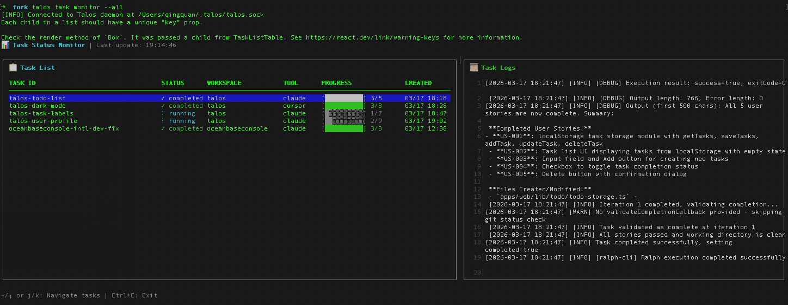

# Talos

**[English](../README.md)**

Talos 是一个基于 Ralph 的 CLI 工具，支持在 Claude Code、Cursor cli 下运行。它支持你并行的在多个仓库下、执行多个 Ralph Loop 任务。

## 安装

```bash
# 全局安装
npm install -g talos-cli

# 或使用 pnpm
pnpm add -g talos-cli

# 或使用 npx（无需安装）
npx talos-cli
```



## 快速开始

### 1. 添加工作区

```bash
talos workspace add
```

### 2. 生成 PRD

通过 AI 对话创建产品需求文档。

```bash
talos prd
# 可选：--tool claude|cursor  --model <模型>  （--stream 同样支持这两项）
```

### 3. 转换 PRD

将 PRD 转换为 Ralph 格式，用于 AI 执行。

```bash
talos ralph --prd my-feature
# 可选：--tool claude|cursor  --model <模型>
```

### 4. 启动任务

启动任务执行 PRD。未指定 PRD 时交互式选择。

```bash
talos task start --prd my-feature
# start / resume 可选：--tool claude|cursor  --model <模型>  [--debug]
```

## 工具与模型选项

**`talos prd`**、**`talos ralph`**、**`talos task`** 均支持 **`--tool`** 与 **`--model`**，可在 **Claude Code**（默认）与 **Cursor Agent** 之间切换。

| 命令 | 说明 |
|------|------|
| `talos prd` | 默认 Claude 交互式；Cursor 为无头 `--print`。带 `--stream` 时，两项作用于 stdio JSON 会话。 |
| `talos ralph` | 无头转换，两种工具均支持。 |
| `talos task start` / `resume` | 经守护进程传给 Ralph 执行器。 |

- **`--tool`**：`claude`（默认）或 `cursor`。使用 Cursor 时请配置 `CURSOR_API_KEY` 或执行 `cursor-agent login`（见同目录下 ` CURSOR_AGENT_SETUP.zh-CN.md`）。  
- **`--model`**：可选模型名（如 `sonnet-4`、`opus`；Cursor 侧常见 `composer-1.5`、`sonnet-4`、`auto`）。

```bash
talos prd --tool cursor --model auto
talos prd --stream --tool claude --model sonnet-4
talos ralph --prd my-feature --tool cursor
talos task start --prd my-feature --tool claude --model sonnet-4
talos task resume my-workspace-my-feature --tool cursor --model composer-1.5
```

## 任务运维

### 监控任务进度

```bash
talos task monitor
```

### 进入任务工作目录

```bash
talos task attach <taskId> [-f]
```

### 停止任务

```bash
talos task stop <taskId>
```

### 恢复失败的任务

```bash
talos task resume <taskId>
```

### 删除任务

```bash
talos task remove <taskId>
```

### 清除失败任务

```bash
talos task clear [--force]
```

## 获取帮助

```bash
talos --help
talos <command> --help
```

## 完整命令文档

查看所有命令及参数说明：[packages/cli/README.md](../packages/cli/README.md)
